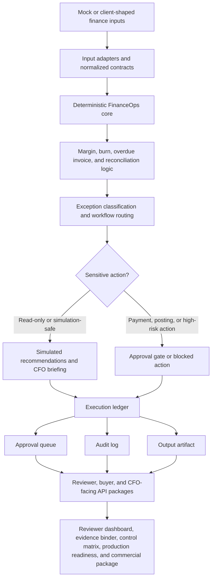

# FinanceOps Agent Architecture Diagram

This diagram gives technical, CFO-style, and AI-company reviewers a fast mental model of the FinanceOps Agent system.

The project should be reviewed as a governed FinanceOps automation core, not as a generic chatbot and not as a production-ready enterprise deployment.

## How to read the diagram

1. **Inputs stay controlled.** The public repo uses mock data. Client-shaped data should only be introduced as safe samples or inside a client-owned environment.
2. **Finance logic is deterministic.** Calculations and classifications are handled by typed FinanceOps logic, not by AI-generated guesses.
3. **Sensitive actions are gated.** Payments, accounting postings, and high-risk actions require human approval or remain blocked.
4. **Evidence is persisted.** The system produces ledgers, approval queues, audit logs, and output artifacts so reviewers can inspect what happened.
5. **Reviewer packages sit on top.** The buyer-facing and reviewer-facing API packages explain the system, its proof points, and its production blockers.

## Core boundary

Client-shaped inputs -> normalized contracts -> deterministic finance logic -> approval gates -> persisted artifacts -> reviewer-facing packages.

AI-style wording can explain outputs, but it must not become the source of financial truth.

## Production boundary

The public repository is demo-safe and production-aware, but production remains blocked until client-owned controls exist for production data handling, authentication, authorization, secrets, payment rails, accounting write-back, monitoring, audit retention, incident response, and compliance signoff.

## Best reviewer commands

- `pnpm run verify:local`
- `pnpm run demo:client-reviewer-dashboard-package`
- `pnpm run demo:ai-company-reviewer-path`
- `pnpm run demo:reviewer-command-index`
- `pnpm run demo:api-inventory`
- `pnpm run demo:openapi-contract`
- `pnpm run demo:audit-visibility`
- `pnpm run demo:accounting-workflow-router`
