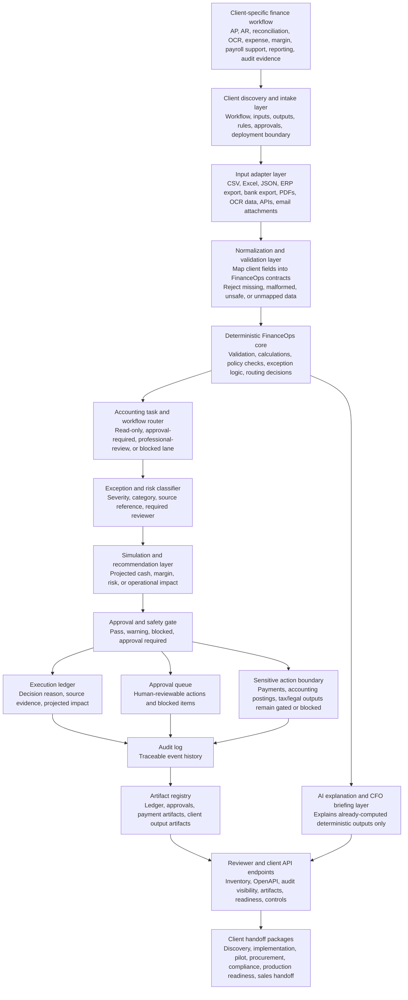

# FinanceOps Agent Architecture Overview

This document gives technical reviewers, AI-company reviewers, CFO-style buyers, founders, and potential clients a quick visual map of the FinanceOps Agent architecture.

FinanceOps Agent is a configurable FinanceOps automation core for client-specific accounting and finance operations workflows.

The public repository is a demo-safe implementation core. It uses mock data, deterministic finance logic, approval-gated action boundaries, audit artifacts, and reviewer-facing API endpoints.

Production use remains blocked until a client provides safe samples, accepted mappings, client-owned credentials, authentication, authorization, monitoring, retention rules, deployment requirements, and approval policies.

## High-level architecture



## What is configurable per client

A client-specific implementation can change:

- input adapters
- source documents and file formats
- OCR or document extraction rules
- normalized finance schemas
- validation logic
- calculation rules
- exception detection logic
- workflow routing rules
- approval gates
- output adapters
- dashboard payloads
- audit artifacts
- delivery format
- deployment boundary
- authentication and authorization model
- monitoring and retention requirements

The reusable core stays stable. The client-specific adapter, mapping, workflow, approval, output, and deployment layers change per client.

## Current demo workflows

The public repository demonstrates the architecture through safe mock workflows, including:

- overdue invoice review
- bank reconciliation examples
- orphan transaction detection
- project margin review
- budget burn review
- payment approval boundary examples
- CFO briefing generation
- audit and artifact traceability
- commercial and production-readiness packaging

These workflows prove the pattern. They should not be described as the only workflows the system can support.

## What this architecture proves

- The FinanceOps Agent is not a generic chatbot.
- It is a governed, configurable finance automation core.
- Finance calculations are deterministic and traceable.
- AI-style language is used only to explain already-computed outputs.
- Sensitive actions are blocked, simulated, or approval-gated.
- Client data, credentials, deployment, approvals, and monitoring remain client-owned for production.
- Reviewer-facing endpoints expose auditability, artifacts, controls, readiness, and buyer-facing packages.

## Demo boundary

The current public repository is suitable for portfolio, reviewer, discovery, and pilot conversations.

It should not be described as a production deployment.

Production requires client-owned controls for:

- production data handling
- authentication and authorization
- secrets and credentials
- payment approval rules
- accounting posting rules
- tax and legal review boundaries
- monitoring and incident response
- audit retention
- source-system adapters
- deployment environment
- compliance signoff

## Reviewer demo path

Recommended order for a technical or buyer reviewer:

1. `/client/reviewer-dashboard`
2. `/client/reviewer-audit`
3. `/artifacts/manifest`
4. `/audit/visibility`
5. `/client/control-matrix`
6. `/client/commercial-package`
7. `/client/go-live-package`

Recommended local commands:

```bash
pnpm run verify:local
pnpm run demo:client-reviewer-dashboard-package
pnpm run demo:ai-company-reviewer-path
pnpm run demo:reviewer-path
pnpm run demo:reviewer-command-index
pnpm run demo:api-inventory
pnpm run demo:openapi-contract
pnpm run demo:audit-visibility
pnpm run demo:accounting-workflow-router
```

## Core design principle

FinanceOps Agent should stay honest:

- deterministic logic creates the financial truth
- adapters normalize client-specific inputs
- governance decides what is safe, approval-gated, or blocked
- audit artifacts preserve traceability
- AI improves explanation and reviewer communication only
- production remains blocked until client-owned controls exist
