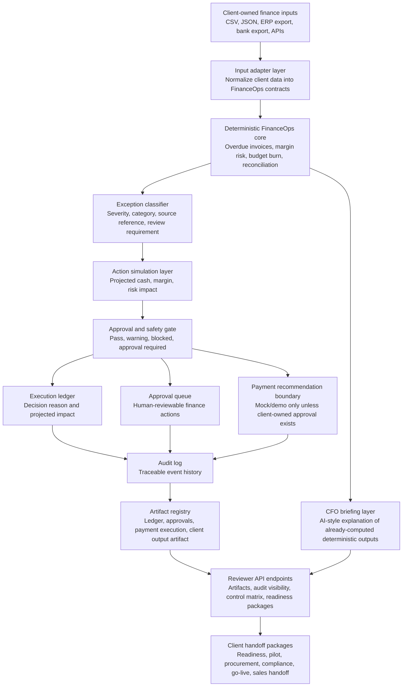

# FinanceOps Agent Architecture Diagram

This document gives technical reviewers, CFO-style buyers, founders, hiring managers, and potential clients a quick visual map of how the FinanceOps Agent works.

The public repository is a demo-safe implementation core. It uses mock data, deterministic finance logic, approval-gated action boundaries, audit artifacts, and reviewer-facing API endpoints. Production use remains blocked until a client provides safe samples, accepted mappings, client-owned credentials, authentication, monitoring, and approval policies.

## High-level system flow

## What this proves

- The FinanceOps Agent is not a generic chatbot. It is a governed finance automation core.
- Finance calculations are deterministic and traceable.
- AI-style language is used only to explain already-computed outputs.
- Sensitive actions are blocked, simulated, or approval-gated.
- Reviewer-facing endpoints expose auditability, artifacts, controls, readiness, and buyer-facing packages.

## Demo boundary

The current public repository is suitable for portfolio, reviewer, discovery, and pilot conversations. It should not be described as a production deployment.

Production requires client-owned controls for:

- production data handling,
- authentication and authorization,
- secrets and credentials,
- payment approval rules,
- accounting posting rules,
- monitoring and incident response,
- audit retention,
- client-specific source-system adapters.

## Reviewer demo path

Recommended order for a technical or buyer reviewer:

1. `/client/reviewer-dashboard`
2. `/client/reviewer-audit`
3. `/artifacts/manifest`
4. `/audit/visibility`
5. `/client/control-matrix`
6. `/client/commercial-package`
7. `/client/go-live-package`

## Core design principle

FinanceOps Agent should stay honest: deterministic logic creates the financial truth, audit artifacts preserve traceability, and AI only improves explanation and reviewer communication.

